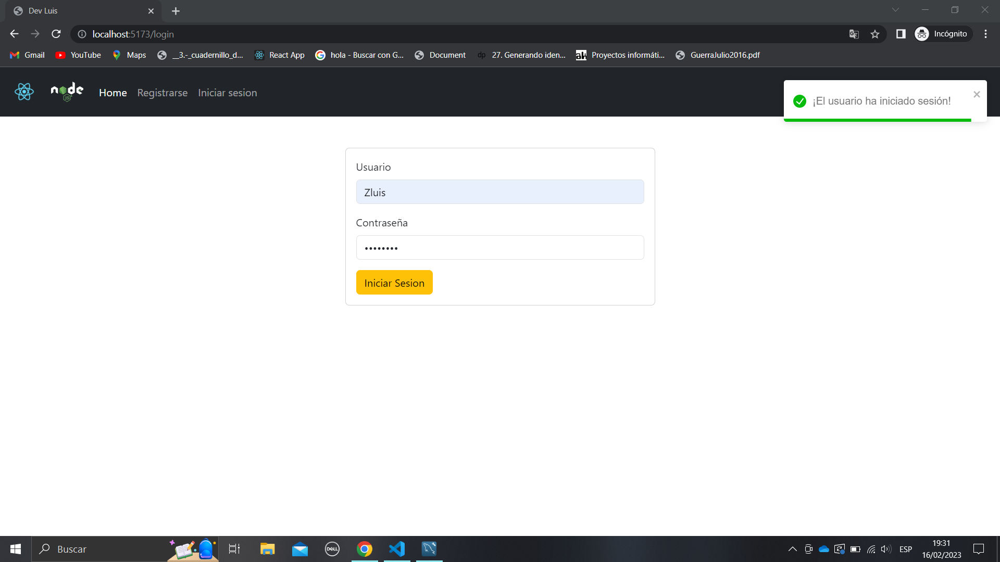
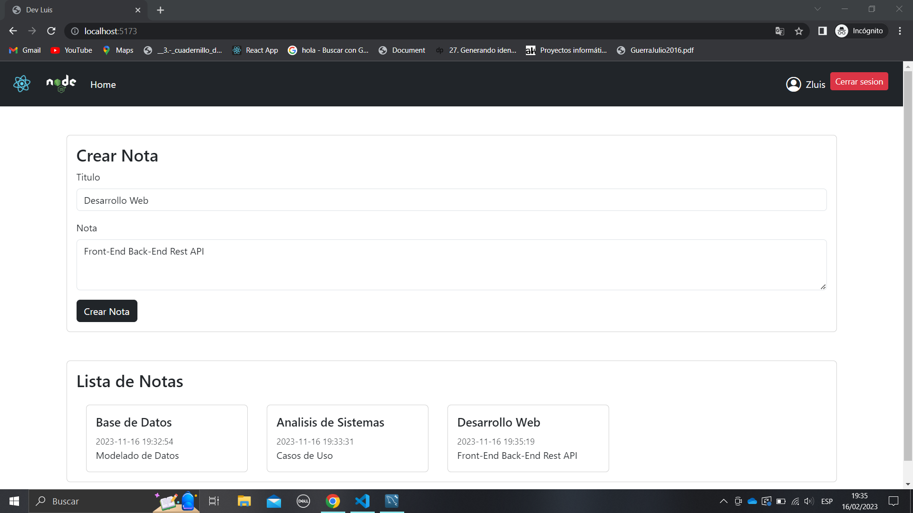

# Autenticacion-De-Usuarios
Full Autenticación  de Usuarios - React Js - Node Js - Vite - Express - MySql

# Inicio de Sesion

# Registro de usuario

# Inicio de pagina

# Instalacion Local

Base de datos
  - Crear schema en mysql legacy
  - ejecutar Query de Entidades localizada en "/server/database/Base de datos - legacy.sql"

Back-End server Node js

  - Ubicar carpeta "/server"
  - Ejecutar instalacion de dependecias y modulos "npm install" o "yarn install"
  - Configurar variables de configuracion "en el archivo .env ubicado "/server/.env"
    - DATABASE="" USER="" PASS="" HOST=""
  - Ejecutar servidor - "npm run dev"

Front-End React js
  - Ubicar carpeta "/client"
  - Ejecutar instalacion de dependecias y modulos "npm install" o "yarn install"
  - Ejecutar aplicacion - "npm run dev"

 
